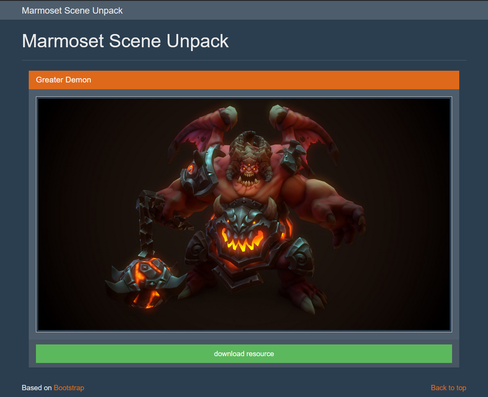

# Marmoset View Unpacker

## Installation & Run

Prepare your own marmoset scene files and place the `.mview` files in the `public/mview` folder. Then run command below:

```
npm install
npm install -g gulp
gulp
```

## Usage

Visit http://localhost:8000/ in your browser and click download resource button. Have fun.



## License

Copyright (c) 2018 bitdewy@gmail.com
For more infomatoin, see the [LICENSE](LICENSE) file in this repository.
